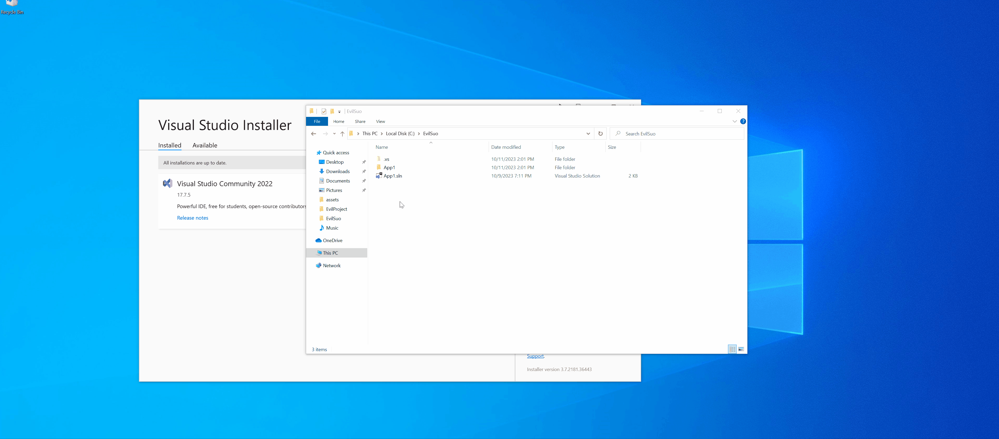
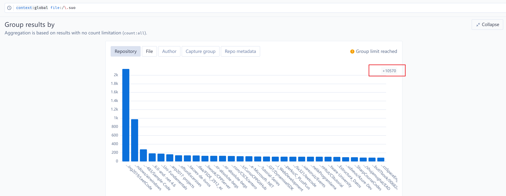

# EvilSln: Don't open .sln files

A New Exploitation Technique for Visual Studio Projects

# Background

Using code projects for phishing attacks is not a new concept. In early 2021, the Lazarus APT group employed a specific attack technique in their campaign targeting security researchers. They embedded malicious event commands within Visual Studio project files, allowing the execution of harmful code during project compilation, as detailed in: [Active North Korean campaign targeting security researchers](https://blog.google/threat-analysis-group/active-north-korean-campaign-targeting-security-researchers/)

This incident has once again brought the security of Visual Studio into the public eye. However, it is important to note that Visual Studio is not the only product with such risks. JetBrains' IDEs, VSCode, and other text editors also face similar vulnerabilities when opening unsafe projects. As a response, these products have introduced trust zone mechanisms that disable certain risky functionalities in untrusted environments, aiming to protect their users.

In this repository, we present a new exploitation technique for Visual Studio projects **(Microsoft consider it is not a security issue)** and provide a proof of concept. Our intention is to raise awareness about the potential risks involved and empower individuals to avoid being hacked.

# Detail Analysis

## Execution

Here are some publicly disclosed methods for exploiting Visual Studio:

1. `PreBuildEvent`: Executes arbitrary commands before project compilation.

```xml
<PreBuildEvent>
    <Command>
    cmd /c calc
    </Command>
</PreBuildEvent>
```

2. `GetFrameworkPaths Target`: Triggered when viewing code.

```xml
<Target Name="GetFrameworkPaths">
    <Exec Command="calc.exe"/>
</Target>
```

3. `COMFileReference`: Triggered when loading `TypeLib` during project opening.

```xml
<COMFileReference Include="files\helpstringdll.tlb">
     <EmbedInteropTypes>True</EmbedInteropTypes>
</COMFileReference>
```

(References 2 and 3 are from https://outflank.nl/blog/2023/03/28/attacking-visual-studio-for-initial-access/. We came across this excellent article in the comments after publishing our demo video.)

We wanted to find a way to execute code without the need for compilation, simply by opening the `*.sln` or `*.csproj` project file. We discovered that after opening a project, Visual Studio automatically generates a `.vs` folder in the project's root directory, which contains a special binary file called `.suo`. 

According to the Visual Studio documentation:
https://learn.microsoft.com/en-us/visualstudio/extensibility/internals/solution-user-options-dot-suo-file?view=vs-2022

> When the environment opens a .suo file, it enumerates all currently loaded VSPackages. If a VSPackage implements the `IVsPersistSolutionOpts` interface, then the environment calls the` LoadUserOptions` method on the VSPackage asking it to load all of its data from the `.suo` file.

It means that the `IVsPersistSolutionOpts#LoadUserOptions` function will be called when the `.suo` file is loaded.

By examining the VSPackage that implements `OnLoadOptions`, we can find `VSCorePackage`.

```csharp
// Microsoft.VisualStudio.dll
// Microsoft.VisualStudio.VSCorePackage
protected override void OnLoadOptions(string name, Stream stream)
{
	if (name.Equals(typeof(VsToolboxService).Name))
	{
		VsToolboxService vsToolboxService = this.GetService(typeof(IToolboxService)) as VsToolboxService; 
		if (vsToolboxService != null)
		{
			vsToolboxService.LoadOptions(stream); // [1]
		}
	}
}
```

at `[1]` , `VSCorePackage` will pass the `stream` to `OptionService` and calll `vsToolboxService.OnLoadOptions(stream)`

```csharp
// Microsoft.VisualStudio.Toolbox.VsToolboxService
internal void LoadOptions(Stream stream)
{
	BinaryReader binaryReader = new BinaryReader(stream);
	BinaryFormatter binaryFormatter = new BinaryFormatter();
	int num = binaryReader.ReadInt32();
	for (int i = 0; i < num; i++)
	{
		string text = binaryReader.ReadString();
		int num2 = binaryReader.ReadInt32();
		for (int j = 0; j < num2; j++)
		{
			string text2 = this.Links.Read(stream);
			VsToolboxService.ToolboxItemContainer toolboxItemContainer = (VsToolboxService.ToolboxItemContainer)binaryFormatter.Deserialize(stream); // [2]
			if (text2 != null && File.Exists(text2))
			{
				toolboxItemContainer.LinkFile = text2;
				this.Links.TrackLink(text2);
				this.Items.GetFilteredList(text).Add(toolboxItemContainer);
			}
		}
	}
}
```

And `[2]` will call `BinaryFormatter.Deserialize` to get an object from the stream. This is a familiar use of BinaryFormatter deserialization. Due to insufficient type restrictions, we can directly use `ysoserial.net` to generate a payload and attempt to write it to the `.suo` file. When opening the project in Visual Studio, the malicious `.suo` file will be automatically loaded and trigger the execution of `calc.exe`.

BTW, there is another class with almost the same vulnerability, and interested readers should be able to find it quickly.

## "Bypass" Trust Zones and MOTW?

The situation with Visual Studio is somewhat different. After conducting a search, we found an article [here](https://devblogs.microsoft.com/visualstudio/improving-developer-security-with-visual-studio-2022/) that provides insights.

> For [Visual Studio 2022 Preview 3](https://devblogs.microsoft.com/visualstudio/visual-studio-2022-preview-3-now-available/), you’ll have to manually enable the “trusted locations” feature. Once enabled, Visual Studio will detect if you are attempting to open untrusted content and will show a new dialog that warns you about the security implications:

This setting needs to be manually enabled. However, even two years after the article was published, this setting remains disabled by default. There might be something preventing Visual Studio from enabling it. 


But we still need to bypass the protection of MOTW, don't we?

In our tests, it seems that Visual Studio does not adhere to MOTW. sln files containing MOTW tags downloaded over HTTP can be opened without any warning. It may require specific methods or configurations to trigger the MOTW warning.

All in all, we can bypass the double protection of Trust Zones and MOTW without any effort, which poses a significant risk for unaware users.

# Exploitation

A evil project structure would look like this:

```bash
$ tree -a
.
├── App1
│   └── Form1.cs
├── App1.sln
└── .vs
    └── App1
        └── v17
            └── .suo
```

In theory, the project could be even smaller, but for now, this should be sufficient. Compared to plaintext `.sln` or `.csproj` files, `.suo` is hidden (folders and files starting with `.` are not displayed by default in the file explorer) and its content is harder to read. There is also limited documentation describing the structure of this file, making it easier to overlook even with careful inspection.

Lazarus has shown us how to poison projects:

- Make the project publicly available on GitHub, for example, [Active North Korean campaign targeting security researchers](https://blog.google/threat-analysis-group/active-north-korean-campaign-targeting-security-researchers/)
- Send the project through a social platform, for example, [New campaign targeting security researchers](https://blog.google/threat-analysis-group/new-campaign-targeting-security-researchers/)

Then, guide the victim to open the project. Unlike in 2021, code will be executed when the project is opened, without any additional clicks or missing MOTW / untrusted warning dialog.

With the power of deserialization, an attacker can execute arbitrary code in memory.

# Proof of Concept

1. Clone or download this project

```
git clone https://github.com/cjm00n/EvilSln
```

2. Double-click the `App1.sln` file to open it with Visual Studio. (*.csproj works too)

3. The calculator will pop up.



Tested version: 17.7.5 (VS2022 update at 2023.10). 

No Smartscreen warning, No trust need, No futher interaction need. But it will not be fixed, because Microsoft consider it's not a vulnerability.

# Mitigation

1. Follow the steps outlined in Microsoft's article to manually open relevant settings: [Improving developer security with Visual Studio 2022](https://devblogs.microsoft.com/visualstudio/improving-developer-security-with-visual-studio-2022/)
2. Avoid opening any unknown projects in Visual Studio. As Microsoft states, "Opening a Visual Studio project is an insecure operation."

# Discussion

After discovering this exploit, we promptly reached out to Microsoft for clarification and received a clear response stating that it is not a security issue.

> After investigation, our team decided the issue is not a vulnerability. Opening a Visual Studio project is an insecure operation, as documented here: [https://devblogs.microsoft.com/visualstudio/improving-developer-security-with-visual-studio-2022/](https://devblogs.microsoft.com/visualstudio/improving-developer-security-with-visual-studio-2022/)

This aligns with the response provided in [outflank's blog](https://outflank.nl/blog/2023/03/28/attacking-visual-studio-for-initial-access/). Therefore, this is an exploit that will not be fixed, or rather, a series of exploits that will not be fixed. However, it is evident that there is a vulnerability here. We believe that there are more undisclosed files that automatically load when you open a project. Simply opening such a project is enough to compromise your machine.

Are there any known evil projects in the wild?

We quickly do an investigation using [sourcegraph](https://sourcegraph.com/search?q=context%3Aglobal+file%3A%2F%5C.suo&patternType=standard&sm=1&groupBy=repo&expanded=) and found that there are **at least 10,570 repositories** on GitHub that contain .suo files. Unfortunately, we didn't have the time to inspect whether any of them contain malicious content.



Regardless, please be careful when using your IDE, especially Visual Studio. it does many things that you are unaware of under its roaring hood.
# Credit

cjm00nw & [edwardzpeng](https://twitter.com/edwardzpeng)
